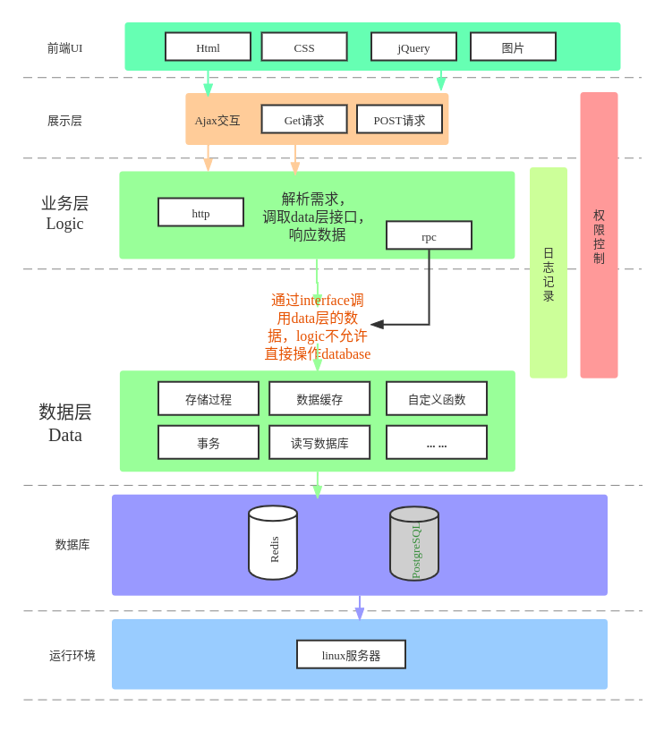

# openblog

An open source blog system,  pured written by go programming language.

# 构建一个标准的go后端项目架构
- **支持启动http服务,及全链路调用追踪**
- **支持启动grpc服务，及全链路调用追踪**
- **支持http服务和grpc服务的优雅退出**
- **rpc客户端链接支持多种编码，支持通用的jsonrpc**
- **支持各种客户端链接(redis, elasticsearch，rpc)**
- **支持启动配置文件校验**
- **rpc支持多种编码方式： msgpack、gob、json、proto(使用较为繁杂，不推荐,已去除)**
- **rpc服务重启重链**
- 无需nohup命令，自带支持后台运行，运行添加-daemon参数（仅限unix平台）
- 所有的启动入口从读取一个环境配置文件开始
- 所有的链接、初始化均显示进行，通过wire工具自动生成InitApp方法
- 支持微服务架构拆分（项目充分解藕、内聚合）

- 业务逻辑曾只允许通过repo调取dao，不允许直接操作db。
- 业务逻辑曾可以调用data层接口，反之不行。
- 做微服务架构时候，data层可以单独抽出来做独立的服务


## 快速开始
```shell
make run

```
## 项目结构图

