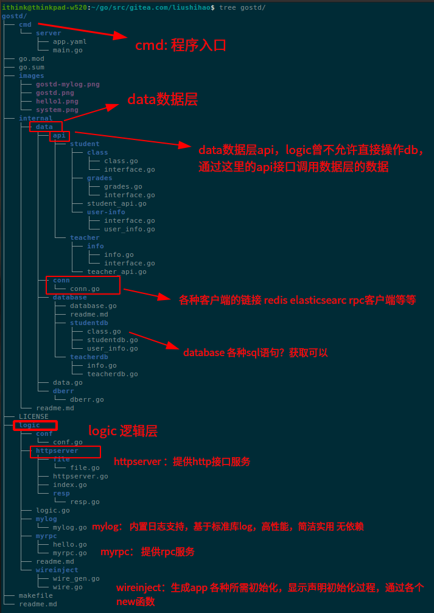
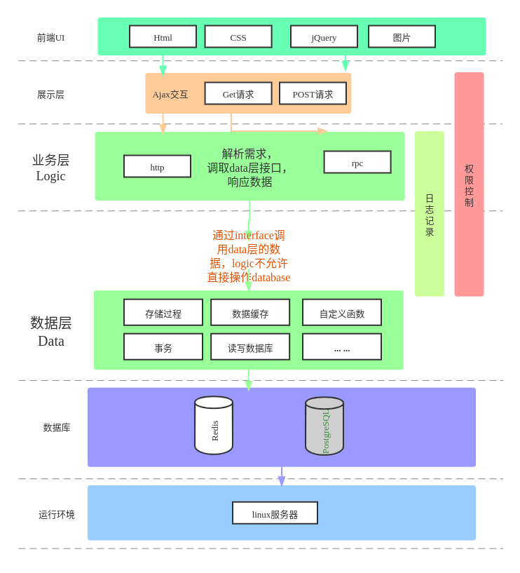
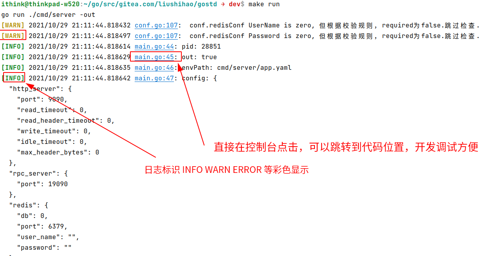
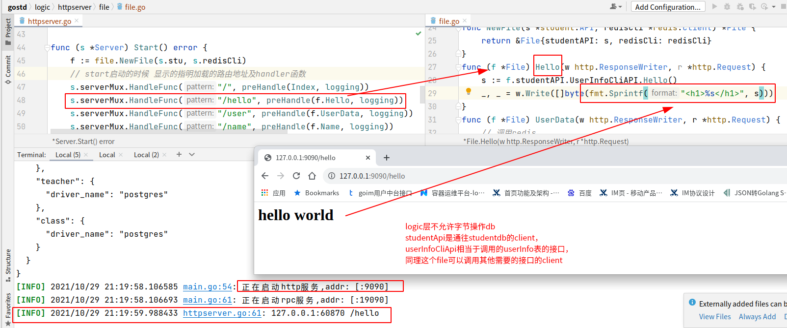

# 构建一个标准的go后端项目架构
- **支持启动http服务**
- **支持启动grpc服务**
- **支持各种客户端链接(redis, elasticsearch)**
- **支持启动配置文件校验**
- **支持http服务和grpc服务的优雅退出**
- **支持后台运行**，无需nohup命令，运行添加-daemon参数（仅限unix平台）
- 所有的启动入口从读取一个环境配置文件开始
- 所有的链接、初始化均显示进行，通过wire工具自动生成InitApp方法
- 支持微服务架构拆分（项目充分解藕内聚合，直接将data层抽出来）
- logic层通过interface接口与数据层db进行通信.
- 对于logic层，连接数据库的叫client（简称cli）
- 对于data层，链接数据库层的叫dao(即一个数据库链接)
- **logic不允许直接操作db，只允许通过接口与data层获取数据**，即通过client调用data层提供对应的client的方法获取数据
    - 保证开发分工明确，logic层调用数据安全.
- logic层和data层可以分别开发互不干扰
- 一般来讲，data层是**根据where条件**直接提供一些数据库表中的**全部**或者**个别**字段的数据.
    - 例如通过id查询一个学生的信息(select * from user_info where id=12345;)
    - 将查询结果映射到对应的table的结构体中或者其他。
    - 一般data层不经常增加代码（因为数据库表结构没什么变化，data层理应不经常变动），但logic可能根据业务需求不断增加代码
- 只能logic层调用data层接口，反之不行。


## logic： 业务逻辑层
## internal/data： 数据层
## logic与data层通过接口进行数据传输，logic不允许直接操作db
## 做微服务架构时候，data层可以单独抽出来独立的服务



# 快速开始
```shell
# git初始化
make init;
# 开始运行
make run


```



